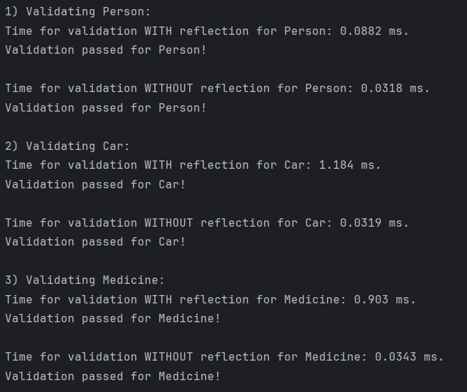
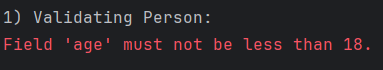
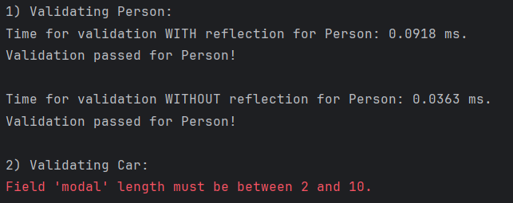
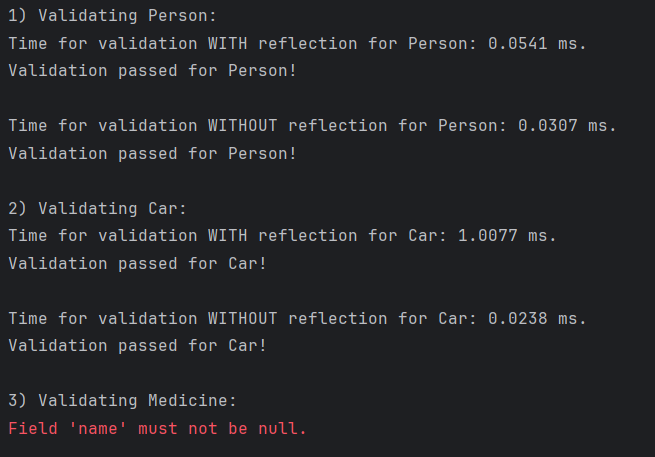

_**Автор**: Вікторія Пекур_

_**Група**: ІО-24_

_**Залікова книжка:** №2420_

**Лабораторна робота №2**

**Тема:** Анотації і рефлексія в Java

**Варіант:** 2420 % 3 = 2

**Опис програми:**

Програма виконує валідацію об'єктів класів Person, Car та Medicine з використанням двох підходів:

1) З рефлексією – перевірка полів об'єкта за допомогою рефлексії.
2) Без рефлексії – перевірка полів об'єкта без використання рефлексії.

Кожен клас має аннотації для валідації полів, такі як:

1) @NotNull для перевірки на null

2) @StringLength для перевірки довжини рядка,

3) @MinValue і @MaxValue для перевірки значень числових полів.

Програма вимірює час, необхідний для виконання кожного підходу валідації (з рефлексією та без), і виводить результати в консолі. Якщо валідація не проходить, викидається виключення з відповідним повідомленням про помилку.

**Демонстрація роботи програми:**

В класі Main створимо об'єкти Person, Car, Medicine та назвемо їх відповідно:

_Person person = new Person("Marta Jenkins", "Software Engineer", 18);_

_Car car = new Car("BMW", "X5", 2015);_

_Medicine medicine = new Medicine("Ibuprofen", "Painkiller", 14, 75);_

Для початку усі параметри зробимо такими, щоб пройшли валідацію, запустимо програму:

В результаті виконання усі об'єкти пройшли валідацію, додатково було виведено час за який виконується валідація з використанням рефлексії та без неї.

Згідно результату можна дійти висновку, що валідація без рефлексії виконується швидше ніж з нею, хоча використання рефлексії здається зручнішим.

Тепер виконаємо декілька запусків зі зміною деяких параметрів на такі, які не пройдуть перевірку, наприклад:

1) Для person змінимо вік з 18 на 10 та отримаємо:

3) Для car змінимо модель X5 на рядок довший за 10 символів і отримаємо:

5) А для medicine вкажемо name як null і отримаємо:

**Висновок:**

Лабораторна робота продемонструвала два підходи до валідації об'єктів в Java: з рефлексією та без неї. Програма успішно перевіряє поля об'єктів класів `Person`, `Car` і `Medicine` за допомогою аннотацій. Валідація без рефлексії показала кращу продуктивність, хоча рефлексія є більш гнучким підходом. Програма коректно обробляє неправильні дані, виводячи відповідні помилки валідації.

